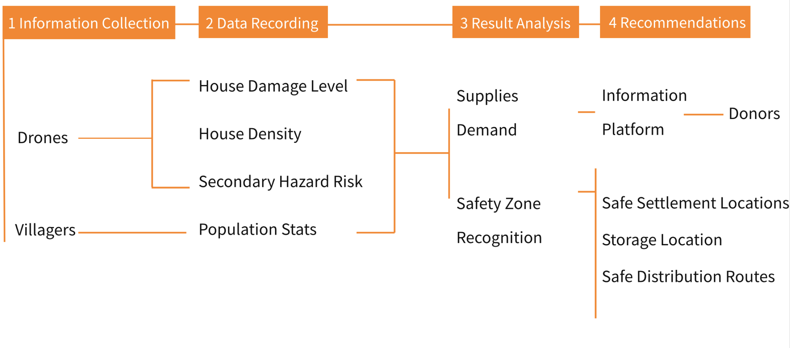
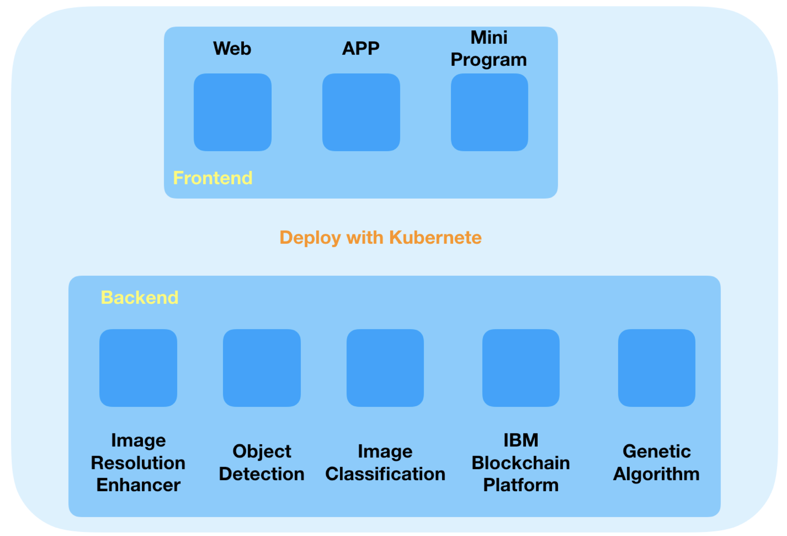
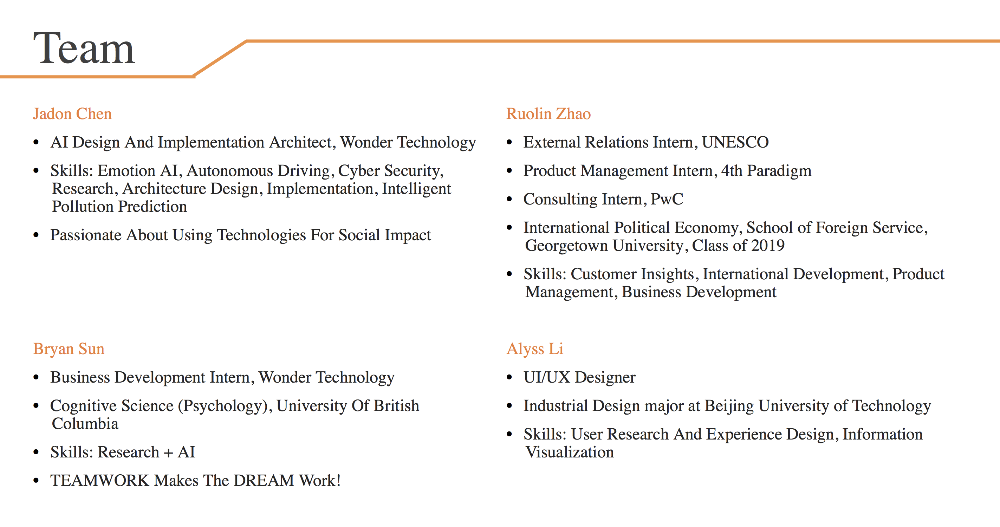
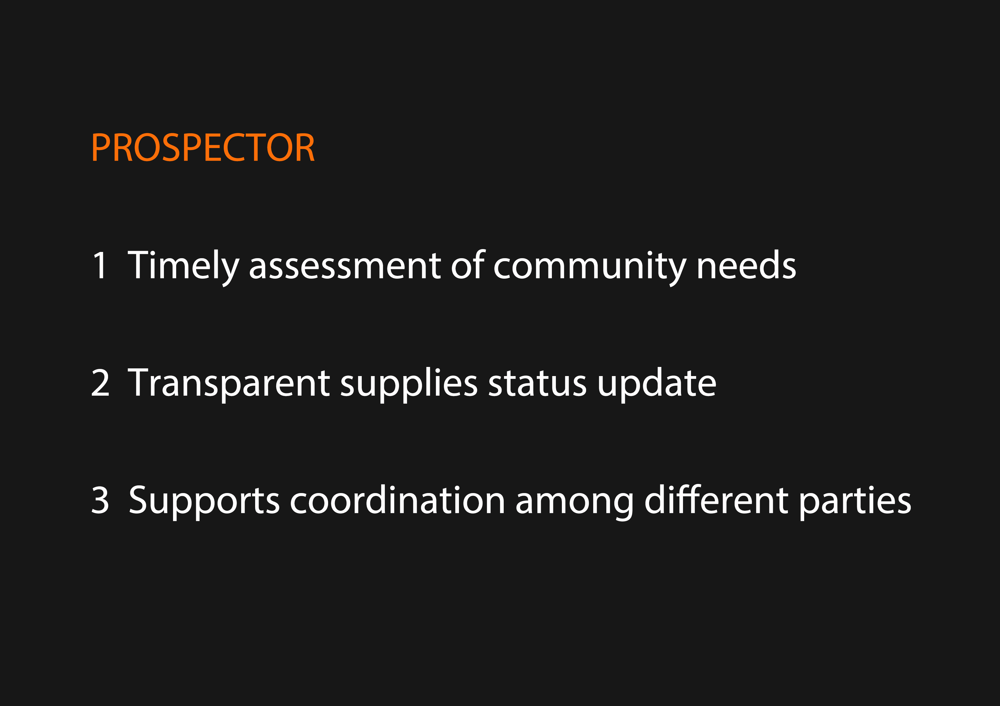
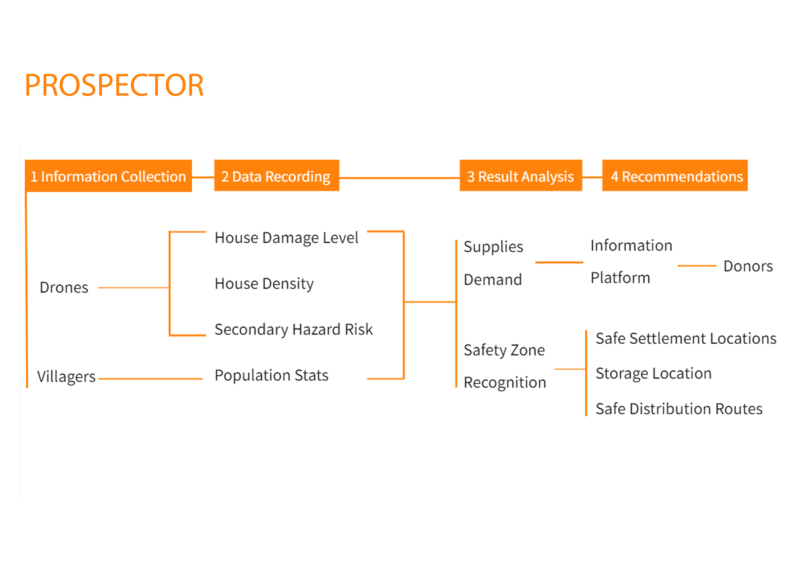
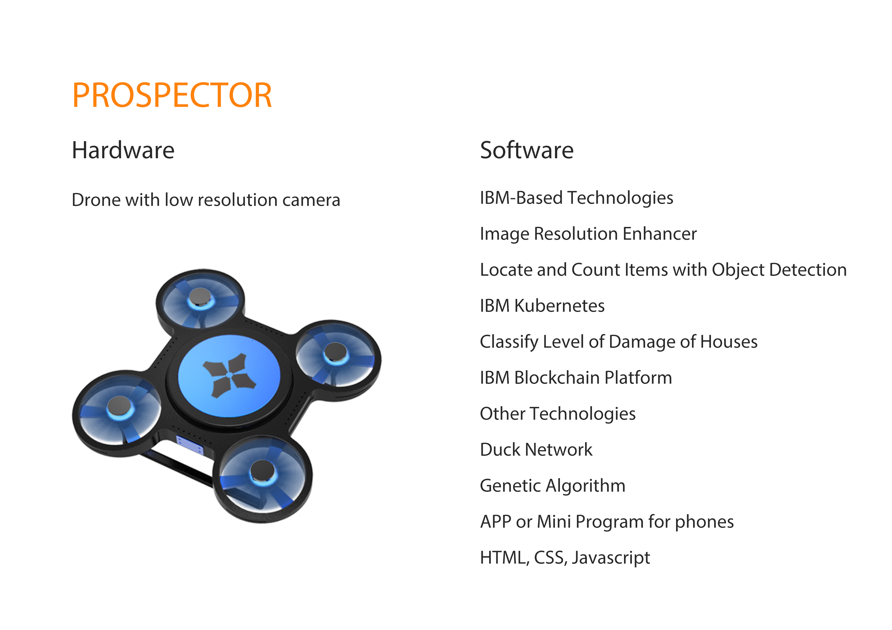
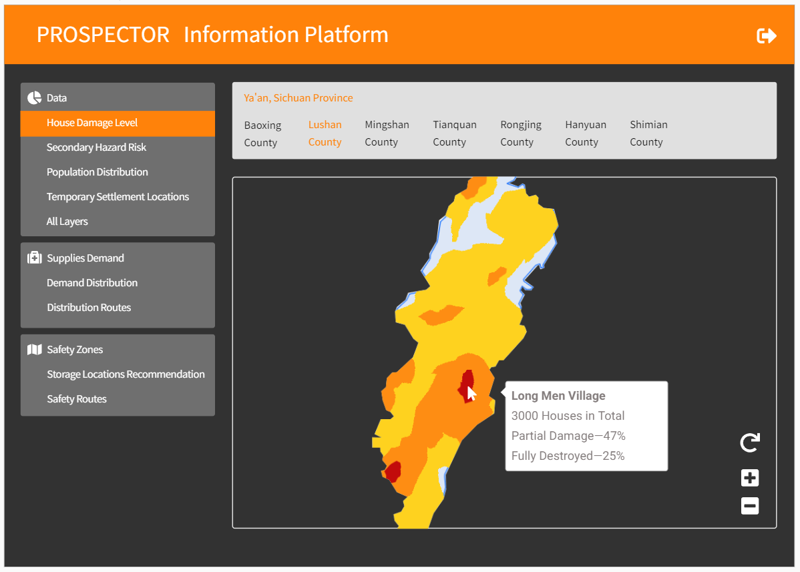
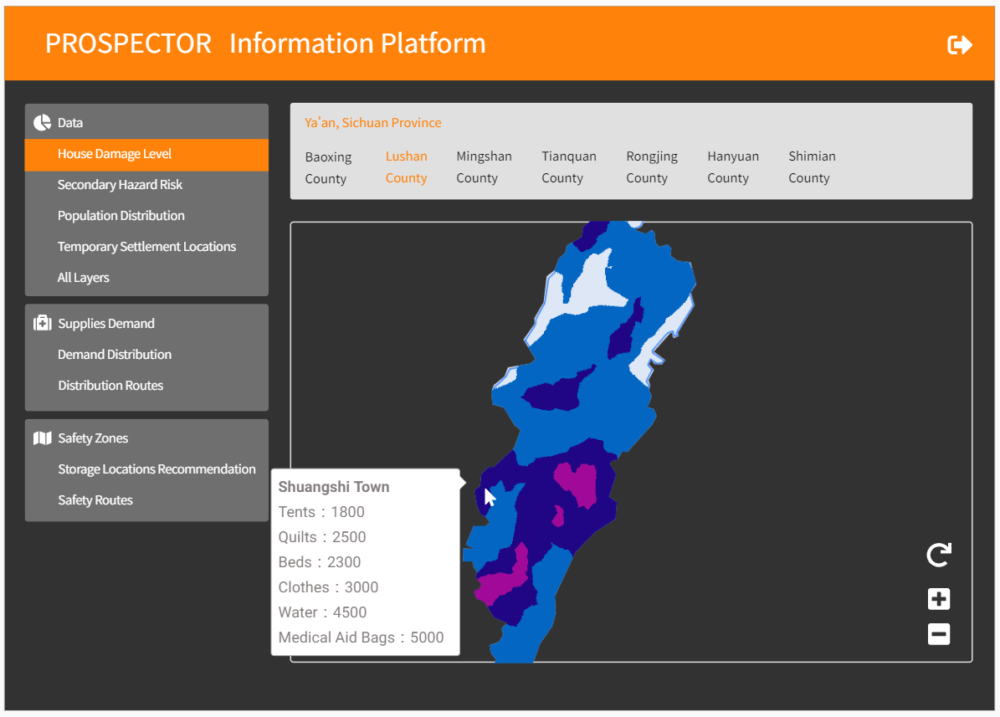
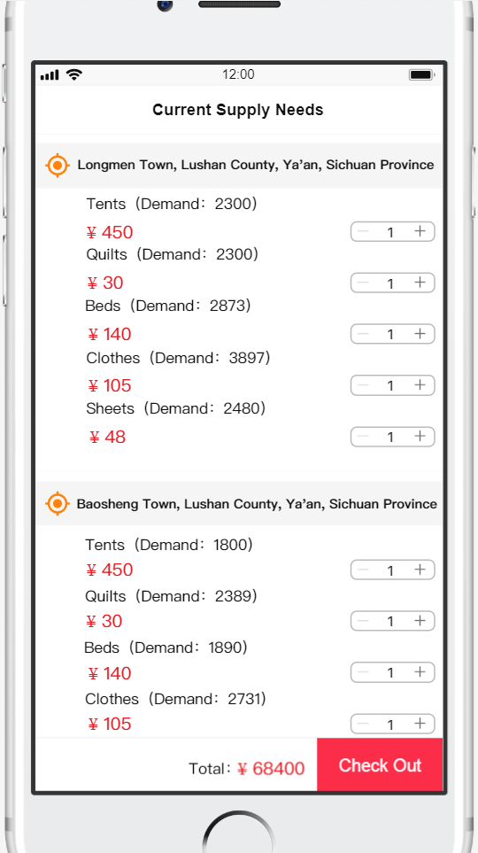
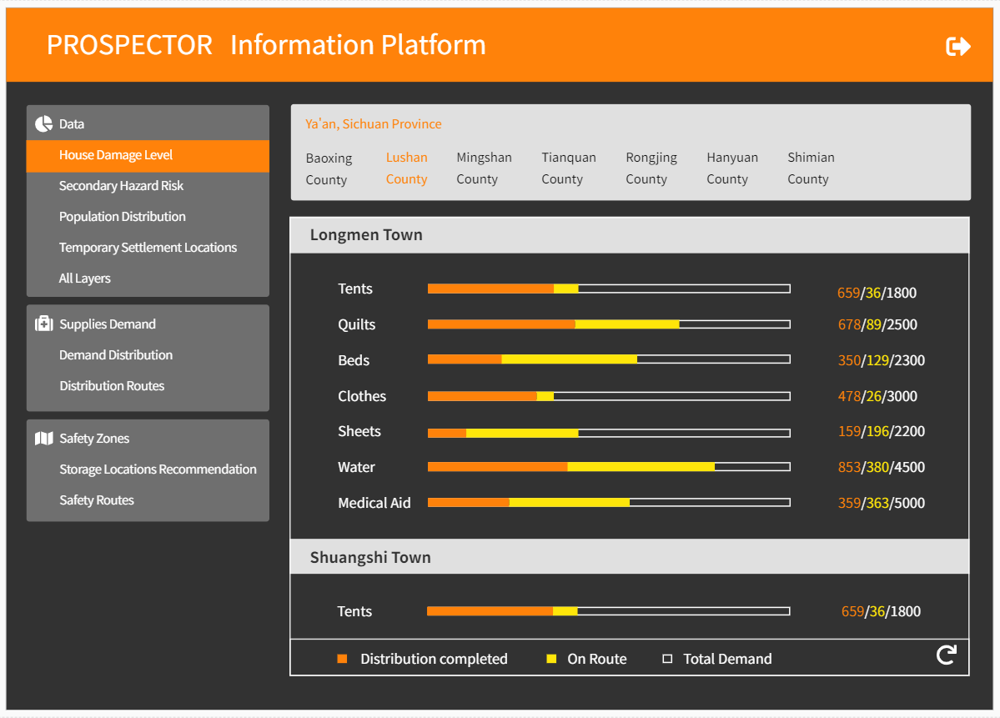

# Introduction
https://youtu.be/HTNtMBfe2Ac
# Flow Chart

# Architecture

# Team

# Tech List
## IBM-Based Technologies
- Image Resolution Enhancer
- Locate and Count Items with Object Detection
- IBM Kubernetes
- Classify Level of Damage of Houses
- IBM Blockchain Platform
## Other Technologies
- Drone with low resolution camera
- Duck Network
- Genetic Algorithm
- APP or Mini Program for phones
- HTML, CSS, Javascript
# Demo
## page1

## page2

## page3

## page4

## page5

## page6

## page7

## page8

## page9
